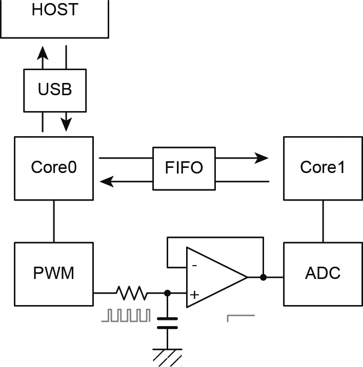

# Test code for mutlicore of Pi Pico

RP2040 has two M0+ cores and Pi Pico sdk has multicore module to use it.

I wrote a simple code for multicore:

1. PWM module on core0 to generate analog level through low pass filter
2. ADC module on core1 to read low pass output
3. ADC runs in free-run mode at highest sampling frequency and over-sample the output
4. core0 also reads USB input from a host and report ADC readout values via USB
5. only two commands from the host
   1. set over-sampling frequency
   2. duty cycle of PWM
6. a user can send commands using a serial communication command-line application i.e., 'screen'

## PWM

PWM runs at highest frequency 125MHz and wrap value 4096 that is the same value of ADC resolution. Therefore, PWM pulse frequency will be about 30kHz. To smooth the PWM low-passed output, the cut off frequency should be enough lower than the pulse frequency, for example, 3kHz.

## ADC
The conversion cycle of ADC free-run mode is 500kHz and its resolution is 12bits. If you take uint32_t variable for summation for over sampling, the variable will overflow above 2 secs. 

It is better to add a buffer amp after low pass filter because the ADC Input impedance is not high enough.
